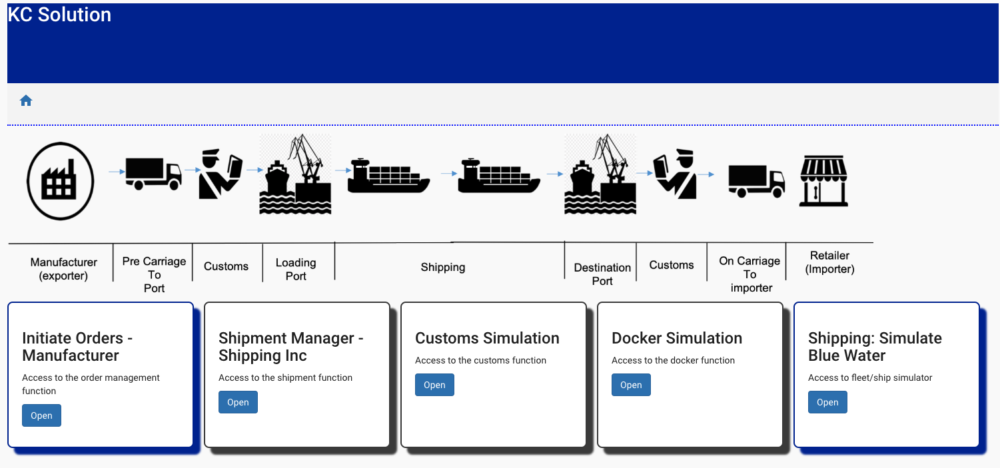

# User Interface and BFF for the K Container shipment solution

This repository includes the user interface in Angular as Single Page Application and the BFF in nodejs to present the container shipment demonstration. It uses the different simulator microservices and functions to support the end to end demonstration. This project is part of the Container shipment reference implementation as presented in [this project](https://github.com/ibm-cloud-architecture/refarch-kc).

## User stories to support

- [ ] As a fleet manager I want to login to the webapp to access the fleet management feature
- [x] As a fleet manager I want to select one of the fleet to get the list of ships with their attributes in a table format, and plot the ship on a map at their respective position (latitude, longitude)
- [ ] As a demoer I want to start ship movement so the ships move on the map
- [ ] As a fleet manager I want to select one ship from the table of ships and present a detail view of it with its containers loaded in the boat
- [ ] As a demoer I want to start the fire to container or heat wave or container down simulation from the detailed ship view
- [ ] As a demoer I want to see the message coming back from the streaming analytics about next best action from my simulation

## Build and Run

The `scripts` folder has two scripts to build the UI, and a docker image for the server and single page app, and run it locally. You should clone all the KC solution repositories and use each component one by one, or use our IBM public cloud deployment. To be able to run the UI locally, you need to have at least the following component up and running:

* Kafka and zookeeper: Use the docker compose file in the root project: 
 ```
 cd ../refarch-kc/docker
 docker-compose -f backbone-compose.yml up
 ```
* Start the Fleet simulator.  For the fleet simulator [see instructions here](https://github.com/ibm-cloud-architecture/refarch-kc-ms/tree/master/fleet-ms#run) to run the simulator locally.

* Make sure you have the angular cli installed via `npm install -g @angular/cli` and run an initial `npm install` inside the ui folder to pull all dependencies.

* Build UI and server and a docker image with the command: `./scripts/build.sh`. The trace looks like:
> .... chunk {main} main.js, main.js.map (main) 78.9 kB [initial] [rendered]
chunk {polyfills} polyfills.js, polyfills.js.map (polyfills) 223 kB [initial] [rendered]
chunk {runtime} runtime.js, runtime.js.map (runtime) 6.08 kB [entry] [rendered]
chunk {styles} styles.js, styles.js.map (styles) 387 kB [initial] [rendered]
chunk {vendor} vendor.js, vendor.js.map (vendor) 6.81 MB [initial] [rendered]
...   
> kcbff@0.0.1 copy-deps /Users/jeromeboyer/Code/GreenCompute/refarch-kc-ui/server
> cpx "../ui/dist/ui/*.*" ./dist/server/static && cpx "./config/config.json" ./dist/server/config   
Successfully built 0226a1748fd9  
Successfully tagged ibmcase/kc-ui:latest

* Start locally with `./script/run.sh` or with a docker `./script/runDocker.sh`. 

* Use your web browser at http://localhost:3000/#/home 


## UI Development

This is a traditional Angular 7 app with the app.module.ts using `shared` and `features` modules. `Shared` is for UI generic widgets, while `features` are for supporting the UI specific components linked to the business logic. 
There is no login page yet, but the home page displays a set of tiles to support the demonstration of the full shipment process as illustrated in the figure below:



For the BFF code the server code is under the `server` folder and uses the standard patterns for expressjs middleware. The [readme file](./server/README.md) goes into the details on this implementation.

This project was generated with [Angular CLI](https://github.com/angular/angular-cli) version 7.1. The user interface features are under the features folder. We are using a TDD approach as described in [this note.](https://github.com/ibm-cloud-architecture/refarch-caseportal-app/blob/master/docs/tdd.md) The tests run with `ng test`. We also encourage to read the [angular.io testing guide](https://angular.io/guide/testing)

### UI Development server

Run `ng serve` for a dev server. Navigate to `http://localhost:4200/`. The app will automatically reload if you change any of the source files.

### UI Build

Run `ng build` to build the project. The build artifacts will be stored in the `dist/` directory. Use the `--prod` flag for a production build.

### UI Running unit tests

Run `ng test` to execute the unit tests via [Karma](https://karma-runner.github.io).

## Deployment

### Deploy on IBM Cloud IKS

### Deploy on IBM Cloud Private 


## Contribute

As this implementation solution is part of the Event Driven architeture reference architecture, the [contribution policies](./CONTRIBUTING.md) apply the same way here.

**Contributors:**
* [Jerome Boyer](https://www.linkedin.com/in/jeromeboyer/)
* [Hemankita Perabathini](https://www.linkedin.com/in/hemankita-perabathini/)

Please [contact me](mailto:boyerje@us.ibm.com) for any questions.